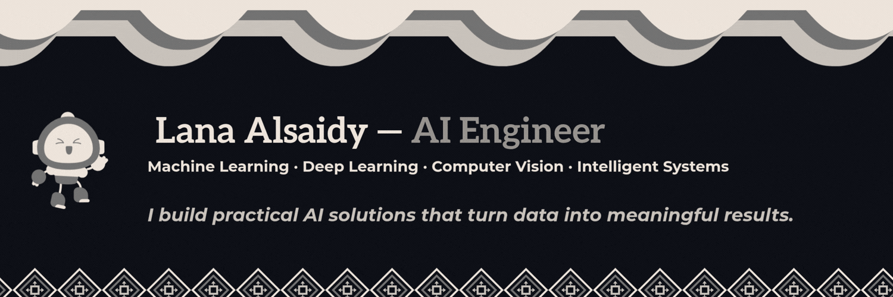

<div align="center">
  
</div>


<div align="center">

<a href="https://www.linkedin.com/in/YOUR_LINKEDIN_USERNAME">
  
</a>
&nbsp;
<a href="mailto:YOUR_EMAIL@example.com">
  
</a>

</div>


<div align="center">

<a href="https://www.linkedin.com/in/YOUR_LINKEDIN_USERNAME">
  
</a>
&nbsp;
<a href="mailto:YOUR_EMAIL@example.com">
  
</a>

</div>


## About Me

Artificial Intelligence graduate with hands-on experience across
**machine learning, deep learning, computer vision, and data analysis**.

I enjoy designing AI solutions for real-world problems, from understanding
data and developing models to evaluating results and exploring practical applications.

---

## What I Work On

<table>
<tr>

<td width="50%" valign="top">

### Artificial Intelligence

- Machine Learning
- Deep Learning
- Applied AI
- Intelligent Systems

</td>

<td width="50%" valign="top">

### Computer Vision

- Image Processing
- Image Classification
- Object Recognition
- Visual Data Analysis

</td>

</tr>

<tr>

<td width="50%" valign="top">

### Data

- Data Analysis
- Data Preprocessing
- Data Visualization
- Exploratory Data Analysis

</td>

<td width="50%" valign="top">

### AI & Technology

- AI Solutions
- AI Consulting
- AI Ethics
- Emerging AI Technologies

</td>

</tr>
</table>

---

## Technical Stack

### Languages

<p>

</p>

### AI / Machine Learning

<p>

</p>

### Data & Development

<p>

</p>

<p>

`NumPy` · `Pandas` · `OpenCV` · `Matplotlib` · `Power BI`

</p>

---

## Featured Projects

> A selection of work across artificial intelligence,
> computer vision, deep learning, and data analysis.

<table>

<tr>

<td width="50%" valign="top">

### 🚦 Traffic Sign Recognition

Computer vision application for recognizing traffic signs
using deep learning techniques.

**Python · Computer Vision · Deep Learning**

</td>

<td width="50%" valign="top">

### 👗 Fashion-MNIST CNN

Image classification project using a convolutional neural
network to classify Fashion-MNIST images.

**CNN · Deep Learning · TensorBoard**

</td>

</tr>

<tr>

<td width="50%" valign="top">

### 📊 Employee Monitoring Dashboard

Interactive Power BI dashboard designed to visualize
and analyze employee-related data.

**Power BI · Data Analysis · Visualization**

</td>

<td width="50%" valign="top">

### 🔬 Fake News Classification

Research project exploring transfer learning and optimization
strategies for BERT-based fake news classification.

**BERT · NLP · Transfer Learning**

</td>

</tr>

</table>

<br>

<div align="center">

<a href="https://github.com/YOUR_USERNAME?tab=repositories">

**Explore all projects →**

</a>

</div>

---

## Research & Interests

**Computer Vision** · **Intelligent Systems** · **Applied AI** ·
**Machine Learning** · **Deep Learning** · **AI Ethics**

Interested in how AI can be developed into solutions that are
useful, reliable, and responsible.

---

## Currently Exploring

```text
→ Building practical AI solutions
→ Exploring Computer Vision & Intelligent Systems
→ Improving machine learning workflows
→ Exploring emerging AI technologies
